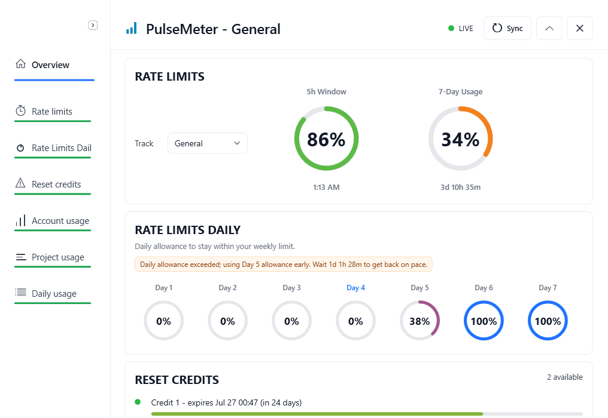

# PulseMeter

PulseMeter is an unofficial Windows tray HUD for Codex usage visibility. It shows rate-limit remaining, reset credits, account usage, and local usage estimates in a compact floating window.

PulseMeter is not affiliated with OpenAI.

## More Screenshots

**Project and daily usage**

**Compact HUD**

## Quick Start

1. Download `PulseMeter-<version>-win-x64-portable.zip` from [GitHub Releases](https://github.com/lorytek/PulseMeter/releases/latest).
2. Extract the zip to a normal folder, for example `Documents\PulseMeter`.
3. Run `PulseMeter.exe`.
4. If Windows shows an unknown-publisher or SmartScreen warning, choose `More info`, then `Run anyway`.

Only run release zips you downloaded from a PulseMeter release page you trust.

## Minimum Requirements

- Windows 10 or Windows 11, 64-bit.
- No .NET install required for the portable release zip.
- Codex CLI installed and signed in for live usage sync.
- Internet access for Codex/OpenAI usage data.

Mock Mode works without Codex CLI, but it shows demo data only.

## Unsigned App Notice

PulseMeter is currently unsigned. Windows may warn that the publisher is unknown because this alpha release does not use a paid code-signing certificate yet.

That warning is expected for this build. It is still a trust decision: only run the app if you downloaded it from the official release location you intended to use.

## What It Shows

- Remaining 5-hour and weekly Codex rate limits.
- Reset-credit count and expiry dates when available.
- Rate-limit daily allowance chunks.
- Account usage summary and recent daily usage.
- Estimated project usage for the last 30 days.
- Live, stale, unavailable, or mock sync status.
- A tray icon with show, hide, refresh, mock mode, and exit controls.

Project usage is an estimate from local Codex metadata, not billing-exact accounting.

## How Live Mode Works

PulseMeter talks to the local Codex CLI/app-server protocol. The Codex Desktop window does not need to be open, so it can also be useful for Codex CLI users.

PulseMeter looks for Codex CLI in this order:

- `PULSEMETER_CODEX_PATH`
- `CODEX_CLI_PATH` in `%USERPROFILE%\.codex\config.toml`
- `%LOCALAPPDATA%\OpenAI\Codex\bin\codex.exe`
- `%USERPROFILE%\.codex\bin\codex.cmd`
- `codex` on `PATH`

If Codex CLI is not found, is not signed in, or `codex app-server` is unavailable, PulseMeter stays open and shows an unavailable status. Mock data is only used when Mock Mode is enabled deliberately.

## Privacy Short Version

- PulseMeter is local-only and has no telemetry.
- It does not modify Codex Desktop, scrape the UI, or use OCR.
- It does not ask for passwords, API keys, or tokens.
- In live mode it may read `%USERPROFILE%\.codex\auth.json` only to request reset-credit expiry metadata from OpenAI.
- It may read `%USERPROFILE%\.codex\state_5.sqlite` and `%USERPROFILE%\.codex\sessions` to estimate project usage shares.
- It does not parse or display Codex message text for project usage estimates.
- Local app settings are stored under `%LOCALAPPDATA%\PulseMeter`.

See [PRIVACY.md](PRIVACY.md) and [SECURITY.md](SECURITY.md) for more detail.

## Open Source

PulseMeter is open source under the [Apache License 2.0](LICENSE), which allows commercial use, modification, redistribution, and private use under Apache-2.0 terms.

The license does not grant permission to imply official OpenAI/Codex affiliation or misuse the PulseMeter name, logo, or release assets.

Small bug fixes and documentation fixes are welcome. Larger features, dependency changes, architecture changes, and refactor-only work should start with an issue first. See [CONTRIBUTING.md](CONTRIBUTING.md).

## Uninstall

1. Exit PulseMeter from the tray menu.
2. Delete the extracted PulseMeter folder.
3. Optional: delete `%LOCALAPPDATA%\PulseMeter` to remove local settings and cached reset-credit countdowns.

## Current Limitations

- Live mode depends on the installed Codex CLI and signed-in Codex state.
- If live app-server access fails, PulseMeter shows unavailable or stale last-good live data.
- The rate-limit and usage parsers are defensive because app-server payloads may evolve.
- Exact current Codex Desktop thread detection is not implemented.
- Project usage is an estimate, not billing-exact accounting. Raw local thread activity is used only for ranking/share and is scaled to account usage.
- Reset credit rows use HUD-local numbers in the UI. Real server credit IDs are not displayed or stored.
- If the reset-credit endpoint is unavailable, PulseMeter falls back to the previous count-based reset-credit display.
