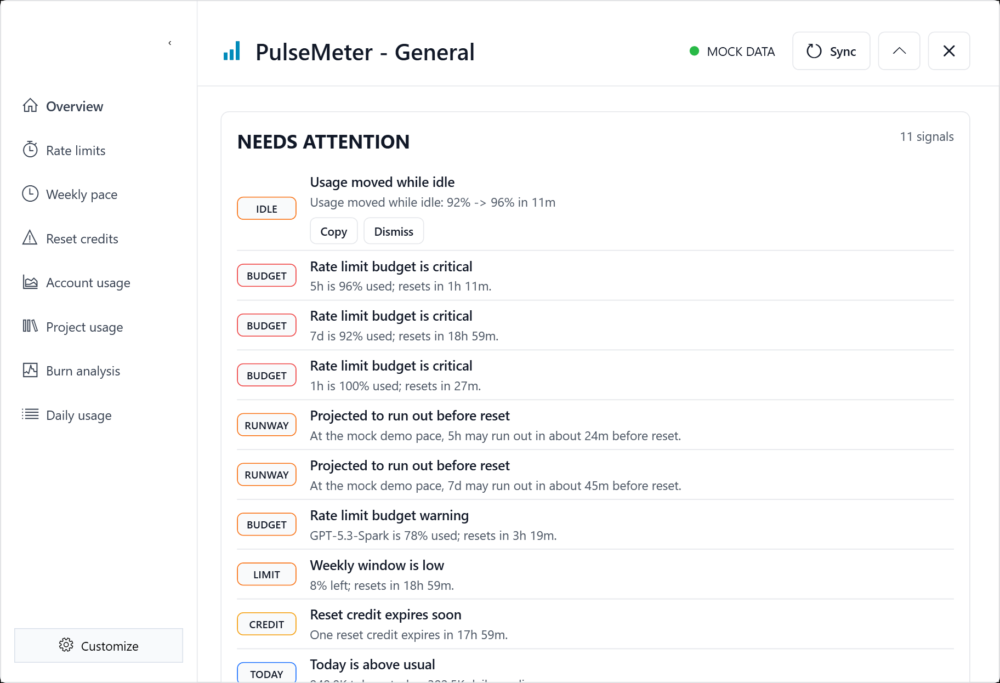
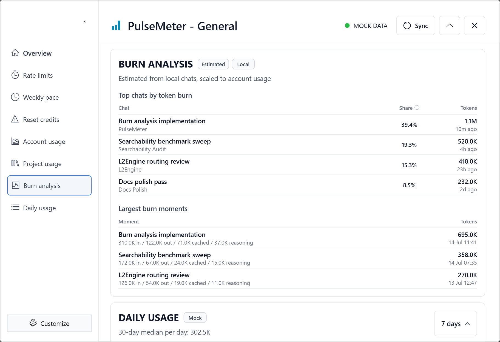
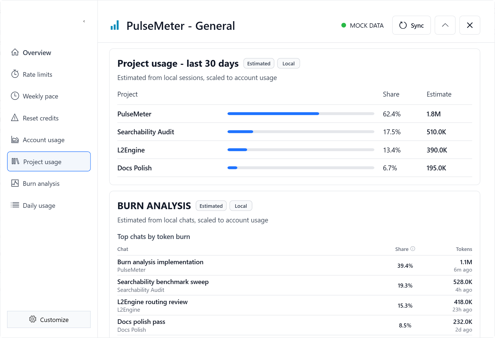
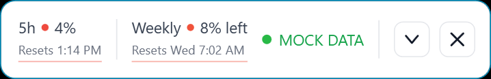

# PulseMeter

PulseMeter is a free local Windows tray app for OpenAI Codex usage limits. It shows rate-limit remaining, reset credits, account usage, local project usage estimates, and local token-burn attribution in a compact floating window.

PulseMeter is not affiliated with OpenAI.

## Download the App

[Download PulseMeter 0.3.0 for Windows](https://github.com/lorytek/PulseMeter/releases/latest/download/PulseMeter-0.3.0-win-x64-portable.zip), extract the ZIP, and run `PulseMeter.exe`.

- A matching `.sha256` checksum file is attached to each GitHub release.
- Windows 10 or Windows 11, 64-bit.
- No .NET install required for the portable release ZIP.

Only run release zips you downloaded from a PulseMeter release page you trust. The `Source code (zip)` and `Source code (tar.gz)` links on GitHub Releases are automatic GitHub source archives for developers, not the portable Windows app.

## New in 0.3.0

- More reliable live quota readings: suspicious drops are confirmed before replacing the last trusted values.
- Better expanded navigation with direct section jumps, top-aligned destinations, a dedicated Customize menu, and improved keyboard access.
- Window placement that stays usable across monitor and work-area changes.
- Burn Analysis groups repeated low-level token updates into clearer per-minute burn moments.
- An adaptive compact HUD that keeps weekly-only data on one line and preserves the full two-limit layout when both limits are available.
- Refreshed screenshots covering the current dashboard, Burn Analysis, project attribution, and compact HUD.

## Who This Is For

- Windows users who want Codex rate-limit and reset-credit visibility without opening extra dashboards.
- Codex CLI or Codex Desktop users who want a small always-available tray HUD.
- People who prefer local-first tools: no telemetry, no UI scraping, and no stored credentials.

Have feedback? Comment on the pinned issue: [what Codex usage data should PulseMeter show next?](https://github.com/lorytek/PulseMeter/issues/4)

Want to help share PulseMeter? See [DISCOVERABILITY.md](DISCOVERABILITY.md).

## Screenshots

****

****

****

## Quick Start

1. Download `PulseMeter-0.3.0-win-x64-portable.zip` from [GitHub Releases](https://github.com/lorytek/PulseMeter/releases/latest).
2. Extract the zip to a normal folder, for example `Documents\PulseMeter`.
3. Run `PulseMeter.exe`.
4. If Windows shows an unknown-publisher or SmartScreen warning, choose `More info`, then `Run anyway`.

## Minimum Requirements

- Windows 10 or Windows 11, 64-bit.
- No .NET install required for the portable release zip.
- Codex CLI installed and signed in for live usage sync.
- Internet access for Codex/OpenAI usage data.

Mock Mode works without Codex CLI and shows full showcase demo data, including alert states.

## Unsigned App Notice

PulseMeter is currently unsigned. Windows may warn that the publisher is unknown because this alpha release does not use a paid code-signing certificate yet.

That warning is expected for this build. It is still a trust decision: only run the app if you downloaded it from the official release location you intended to use.

## What It Shows

- Remaining 5-hour and weekly Codex rate limits.
- Compact tray reset times: local time for 5-hour limits and weekday plus time for weekly limits.
- Reset-credit count and expiry dates when available.
- Rate-limit daily allowance chunks.
- Account usage summary and recent daily usage.
- Estimated project usage for the last 30 days.
- Burn Analysis showing top local chats by estimated token burn and largest grouped burn moments for the last 30 days.
- Needs Attention automatic alert signals for local usage and rate-limit risk.
- Limit Runway estimates when a 5-hour or weekly pool may run out before reset.
- Idle Drain Detector flags usage movement while Windows reports you were idle.
- Live, stale, unavailable, or mock sync status.
- A tray icon with show, hide, refresh, mock mode, and exit controls.

Project usage, Burn Analysis, automatic alert signals, Limit Runway, and Idle Drain Detector are local estimates and diagnostics, not billing-exact claims.

## How Live Mode Works

PulseMeter talks to the local Codex CLI/app-server protocol. The Codex Desktop window does not need to be open, so it can also be useful for Codex CLI users.

PulseMeter looks for Codex CLI in this order:

- `PULSEMETER_CODEX_PATH`
- `CODEX_CLI_PATH` in `%USERPROFILE%\.codex\config.toml`
- `%LOCALAPPDATA%\OpenAI\Codex\bin\codex.exe`
- `%USERPROFILE%\.codex\bin\codex.cmd`
- `codex` on `PATH`

If Codex CLI is not found, is not signed in, or `codex app-server` is unavailable, PulseMeter stays open and shows an unavailable status. Mock data is only used when Mock Mode is enabled deliberately.

## Privacy Short Version

- PulseMeter is local-only and has no telemetry.
- It does not modify Codex Desktop, scrape the UI, or use OCR.
- It does not ask for passwords, API keys, or tokens.
- In live mode it may read `%USERPROFILE%\.codex\auth.json` only to request reset-credit expiry metadata from OpenAI.
- It may read `%USERPROFILE%\.codex\state_5.sqlite`, `%USERPROFILE%\.codex\sessions`, and local rollout `token_count` records to estimate project usage and Burn Analysis shares.
- It does not parse or display Codex message text for project usage or Burn Analysis estimates.
- Burn Analysis displays project paths, thread titles/IDs, timestamps, and token counts only.
- Automatic alert signals use local usage and rate-limit numbers; they do not read prompt text or Codex message content.
- Idle Drain alerts do not read prompt text or Codex message content.
- Local app settings are stored under `%LOCALAPPDATA%\PulseMeter`.

See [PRIVACY.md](PRIVACY.md) and [SECURITY.md](SECURITY.md) for more detail.

## Roadmap

- [Code signing for Windows releases](https://github.com/lorytek/PulseMeter/issues/5)
- [Better current-thread or current-project detection](https://github.com/lorytek/PulseMeter/issues/6)
- [Optional in-app update check](https://github.com/lorytek/PulseMeter/issues/7)

## Open Source

PulseMeter is open source under the [Apache License 2.0](LICENSE), which allows commercial use, modification, redistribution, and private use under Apache-2.0 terms.

The license does not grant permission to imply official OpenAI/Codex affiliation or misuse the PulseMeter name, logo, or release assets.

Small bug fixes and documentation fixes are welcome. Larger features, dependency changes, architecture changes, and refactor-only work should start with an issue first. See [CONTRIBUTING.md](CONTRIBUTING.md).

## Uninstall

1. Exit PulseMeter from the tray menu.
2. Delete the extracted PulseMeter folder.
3. Optional: delete `%LOCALAPPDATA%\PulseMeter` to remove local settings and cached reset-credit countdowns.

## Current Limitations

- Live mode depends on the installed Codex CLI and signed-in Codex state.
- If live app-server access fails, PulseMeter shows unavailable or stale last-good live data.
- The rate-limit and usage parsers are defensive because app-server payloads may evolve.
- Exact current Codex Desktop thread detection is not implemented.
- Project usage and Burn Analysis are estimates, not billing-exact accounting. Raw local thread activity is used only for ranking/share and is scaled to account usage.
- Reset credit rows use HUD-local numbers in the UI. Real server credit IDs are not displayed or stored.
- If the reset-credit endpoint is unavailable, PulseMeter falls back to the previous count-based reset-credit display.
