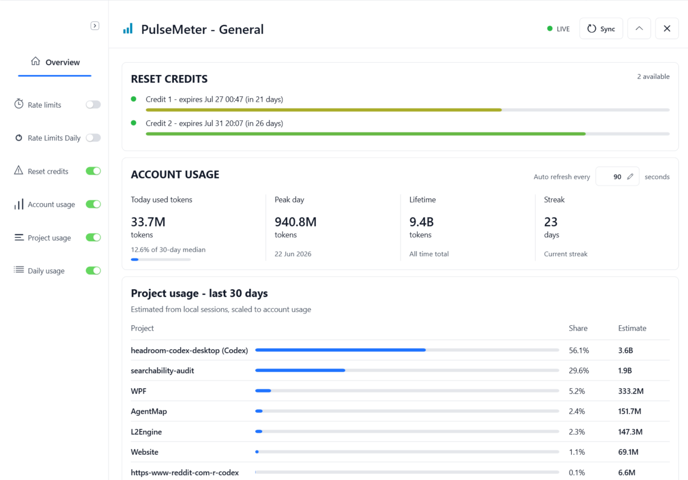

  

# PulseMeter

PulseMeter is a free Windows tray app that helps Codex users keep an eye on usage limits, reset credits, and recent usage without opening the full usage page every time.

It is an unofficial companion app and is not affiliated with OpenAI.

## Screenshots

  

  

  

## Download

Download the latest portable Windows build from GitHub Releases:

[Download PulseMeter for Windows](https://github.com/lorytek/PulseMeter/releases/latest/download/PulseMeter-0.1.0-win-x64-portable.zip)

## What It Does

PulseMeter floats quietly on your desktop and shows a quick Codex-style usage summary:

- 5-hour usage remaining.
- Weekly usage remaining.
- Reset-credit count and expiry dates when available.
- Daily allowance view for staying within weekly limits.
- Account usage summary.
- Estimated project usage for the last 30 days.
- Local sync status, including live, stale, unavailable, or mock mode.

## Features

- Compact floating HUD for quick usage checks.
- Expanded dashboard with rate limits, reset credits, account usage, project usage, and daily usage.
- Tray icon with show, hide, refresh, mock mode, and exit controls.
- Live sync through the local Codex CLI/app-server when available.
- Portable release: extract, run, delete the folder to uninstall.
- No telemetry or maintainer-owned tracking.

## Install

1. Download `PulseMeter-0.1.0-win-x64-portable.zip` from the latest release.
2. Extract the zip to a normal folder, for example `Documents\PulseMeter`.
3. Run `PulseMeter.App.exe`.
4. If Windows shows an unknown-publisher or SmartScreen warning, choose `More info`, then `Run anyway`.

PulseMeter is currently unsigned, so the Windows warning is expected for this alpha build. Only run release zips you downloaded from a PulseMeter release page you trust.

## Requirements

- Windows 10 or Windows 11, 64-bit.
- No .NET install required for the portable build.
- Codex CLI installed and signed in for live usage sync.
- Internet access for Codex/OpenAI usage data.

Mock Mode works without Codex CLI, but it shows demo data only.

## How To Use

- Start `PulseMeter.App.exe`.
- Use the tray icon to show, hide, refresh, switch mock mode, or exit.
- Click the floating HUD arrow to expand or collapse the dashboard.
- Use `Sync` when you want to refresh usage immediately.
- Use `Exit` from the tray menu when you want to fully close the app.

## Privacy

PulseMeter is local-first:

- It does not modify Codex Desktop, scrape the UI, or use OCR.
- It does not ask for passwords, API keys, or tokens.
- It does not send telemetry or analytics to the maintainer.
- In live mode it may read local Codex auth/session files only to request usage and reset-credit data.
- Local settings are stored under `%LOCALAPPDATA%\PulseMeter`.

See [PRIVACY.md](PRIVACY.md) and [SECURITY.md](SECURITY.md).

## License

PulseMeter uses a proprietary freeware license. You may use the unmodified app for free, but the source code is not open source.

You may not copy, modify, reuse, redistribute, repackage, or create derivative works from the PulseMeter source code without prior written permission. See [LICENSE](LICENSE).

## Current Limitations

- Exact current Codex Desktop thread detection is not implemented.
- Reset-credit expiry relies on currently observed Codex/OpenAI behavior and may change.
- PulseMeter is unsigned, so Windows may show an unknown-publisher warning.
